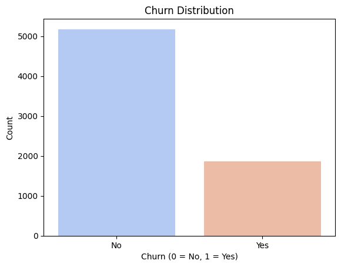
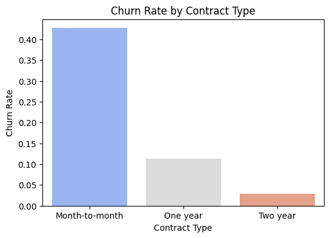
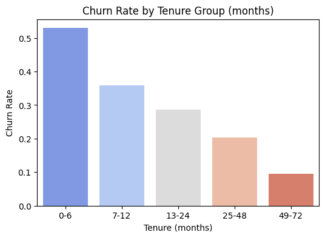
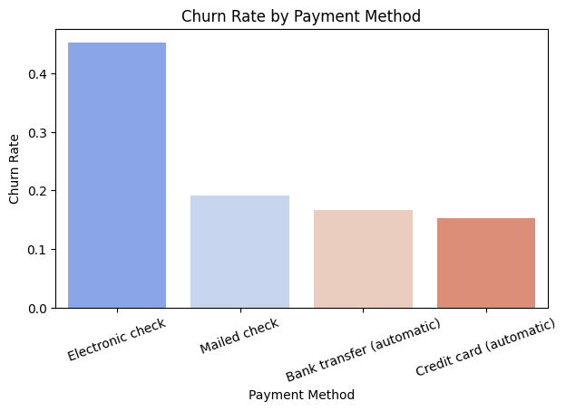
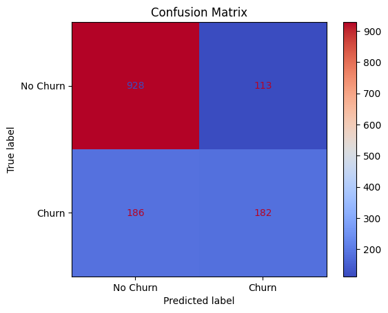
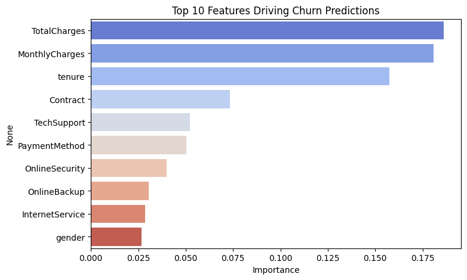

# Telco Customer Churn Analysis

Telecom companies lose money every time a customer cancels their service, and it's
usually cheaper to keep an existing customer than to replace them with a new one.
This project digs into IBM's Telco Customer Churn dataset (7,043 customers) to
figure out who's actually leaving, why, and whether a simple model can catch them
before they go.

Full notebook: [Telco_customer.ipynb](Telco_customer.ipynb)

## The dataset

7,043 customers, 26.5% of whom churned. The average customer pays $64.76/month and
has stuck around for about 32 months. Full column reference is in the notebook's
Data Dictionary section.

## What actually drives churn

Contract length matters more than almost anything else here. Month-to-month
customers churn at 43%, one-year contracts drop to 11%, and two-year contracts
barely churn at all (3%).

Tenure tells a similar story — new customers are the riskiest group. Churn sits
around 53% in the first 6 months and steadily drops to under 10% for customers
who've stuck around 4+ years.

Payment method was the more surprising one. Customers paying by electronic check
churn at 45%, almost triple the rate of customers on autopay (15-19%).

## The model

A Random Forest classifier trained on the cleaned, encoded data:

| Metric | Score |
|---|---|
| Accuracy | 79% |
| Precision | 62% |
| Recall | 49% |
| F1 | 55% |

Accuracy alone is a bit misleading here — only 26.5% of customers churn, so a model
that just guesses "no churn" every time would already be ~73% accurate while being
completely useless. Recall is the more honest number: it catches about half of the
customers who actually leave.

Feature importance ranks `TotalCharges`, `MonthlyCharges`, and `tenure` above
`Contract`, which looks like it contradicts the churn-rate chart above — it doesn't.
Random Forests naturally lean on continuous numeric columns over categories with
only a few values, so this says more about how the model measures importance than
about what actually drives churn from a business perspective. The category
breakdowns above are the more useful read for that.

## Takeaways

- Push customers off month-to-month plans — even a small discount for switching to
  a 1- or 2-year contract would likely pay for itself given the drop in churn.
- Retention efforts matter most in the first 6 months; that's where most of the
  churn happens.
- Something about electronic check correlates with churn — worth digging into
  whether it's friction with that payment method or just who tends to use it.
- Use this model to flag high-risk customers before they cancel, not after.

These are correlations, not proven causes — a real retention campaign would need
A/B testing to confirm what actually moves the needle.

## What I'd improve with more time

- Compare against other models (Logistic Regression, XGBoost)
- Handle the class imbalance more deliberately instead of relying on defaults
- Add SHAP values to explain individual predictions, not just overall feature importance

## Built with

Python, pandas, scikit-learn, seaborn/matplotlib, Google Colab
